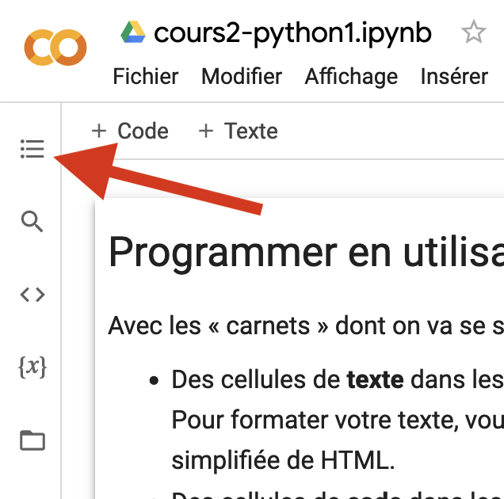
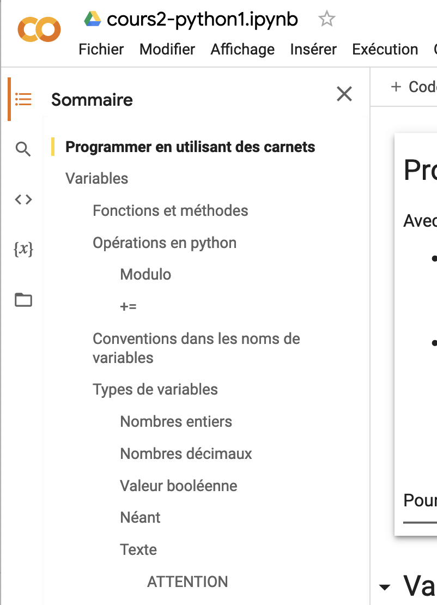

# 🚸 00.Tutoriels


_**En signant l'entente d'évaluation, vous acceptez que je rende public vos travaux sur le site compte Github du programme (j'ignore encore ceux que je prendrai; il est possible que n'en prenne aucun, faute de temps).**_


Seront déposés ici, tout au long de la session, les carnets que je vais réaliser en classe (en Zoom) avec vous, ainsi que d'autres éléments de documentation, au besoin.

* Exemples des [travaux réalisés par les personnes qui vous ont précédé](https://github.com/Journalisme-UQAM/) (dans le compte Github du programme de journalisme).
* Mini tutoriel sur le [_markdown_](https://colab.research.google.com/drive/1nQf6fBVpfhkJxOMGJw\_9G1lwwZBxdczU?usp=sharing), ce « langage » qui permet de formater facilement du texte en ligne, tel qu'il peut être utilisé dans Colab.
* Carnet complet du [Cours 2 - Python 1.](https://colab.research.google.com/drive/124K1pwdMdcSa\_ppzaq5ZPdmBnCG3\_5bK?usp=sharing) Si vous cliquez sur le bouton à trois lignes horizontales indiqué par la flèche rouge ci-dessus ...

... vous aurez accès à une table des matières du carnet : 

* Carnet complet du [cours 3 - python 2](https://colab.research.google.com/drive/1GkL1ZzjB9nQQK8wX5U-0iuJX-BMeoub8?usp=sharing) dans lequel on a notamment vu comment lire et créer des fichiers CSV et interagir avec un API.
