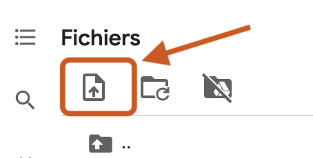
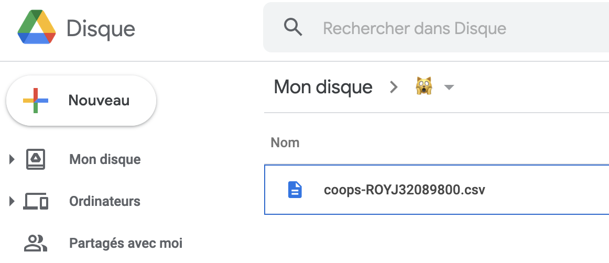
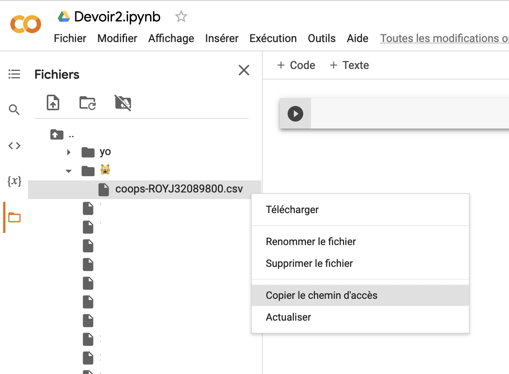

# 🛠 Travaux

Les travaux à remettre ont été mentionnés brièvement dans les pages précédentes. Je vous donne, ci-dessous, un peu plus de détails sur chacun de ces éléments d'évaluation.

Liens directs vers les devoirs:

* [Devoir 1](travaux.md#devoir-1)
* [Devoir 2](travaux.md#devoir-2)
* [Devoir 3](travaux.md#devoir-3)
* [Devoir 4](travaux.md#devoir-4)
* [Devoir 5](travaux.md#devoir-5)

### Devoir 1 (10 points) - Amateurs.trices de sport, bonsoir <a href="#devoir-1" id="devoir-1"></a>

Vous travaillez à partir d'une variable appelée `publications`.

C'est une liste qui contient 1436 autres listes. Chacune de ces autres listes contient des données sur les 1436 publications (ou _« posts »_) Facebook publiées en février 2021 par **RDS**, **TVA Sports** et **Radio-Canada Sports**. Voici un exemple d'une de ces 1436 listes :

`["TVA Sports","2021-02-01 07:00:01 EST","Native Video","https://www.facebook.com/127476907331141/posts/3863888207023307","130","94","8","11","3","5","1","0","0"]`

Chacune contient 13 éléments :

* Nom du média
* Date et heure de la publication
* Type (lien, image, vidéo, etc.)
* URL (vous pouvez tester; chaque URL vous mènera au _« post »_ en question)
* Nombre de « j'aime » suscités par la publication
* Nombre de commentaires
* Nombre de fois que la publication a été partagée
* Nombre de :heart:
* Nombre de :astonished:
* Nombre de :laughing:
* Nombre de :cry:
* Nombre de :rage:
* Nombre de câlinours

C'est ainsi que l'exemple que je vous ai donné est celui d'une publication Facebook de TVA Sports faite le 1er février 2021 à 7h (et une seconde) du matin. En fait, c'est une vidéo ([https://www.facebook.com/127476907331141/posts/3863888207023307](https://www.facebook.com/127476907331141/posts/3863888207023307)) qui a été « likée » 130 fois, qui a provoqué 94 commentaires, qui a été partagée 8 fois et qui a suscité 11 « p'tits cœurs », 3 réactions « wow », 5 de rire, 1 de tristesse, aucune de colère et aucune de solidarité. Bref, et ce sera à vous de le calculer dans votre carnet, cette publication a suscité **252 interactions**.

**Étape 1**

Créez un carnet dans Colab. Appelez-le **devoir1.ipynb**.

**Étape 2**

Utilisez le bouton marqué par la flèche ci-dessous...



... pour y téléverser le fichier **fbSports.py** que vous pouvez trouverez ci-dessous :


FIchier aussi disponible dans le [répertoire Google Drive du cours](https://bit.ly/fichiersColab).


**Étape 3**

Entrez la ligne de code suivante dans la première cellule de votre carnet :

<mark style="color:purple;">`from`</mark>`fbSports`<mark style="color:purple;">`import`</mark>` ``publications`

La variable `publications` est désormais à votre disposition. Si vous cherchez à en voir la taille à l'aide de la fonction `len()`, vous devriez obtenir 1436.

**Étape 4**

Complétez votre carnet avec du code qui vous permettra d'effectuer différentes opérations sur la variable `publications` afin de répondre à la question suivante :

* Les publications de ces médias ont suscité combien d'interactions au total ce mois-là?

Incluez dans votre carnet des cellules de texte pour expliquer ce que fait votre code et pour répondre aux questions.

**Étape 5**

Téléchargez votre carnet en format .ipynb sur votre ordinateur.

Remettez votre carnet (**devoir1.ipynb**) dans Moodle.

Tombée : 23h59, le lundi 24 janvier 2022.

[CORRIGÉ](https://colab.research.google.com/drive/1ihuyypyKd93HeWN0-TRDJq46RTsN6iDb?usp=sharing).

### Devoir 2 (10 points) - Coops de l'information <a href="#devoir-2" id="devoir-2"></a>

Vous trouverez dans Moodle un fichier CSV personnalisé, destiné à vous seul.e. Vous le reconnaîtrez car il contient votre code permanent :

`coops-CODEpermanent.csv`

Le fichier CSV en question contient 750 enregistrements assez simples. Chacun n'a que deux colonnes ou deux éléments:

| 99999 | **04dd6835bf1b509ff683eb17b99f916f** |
| ----- | ------------------------------------ |

Celui qui vous intéresse est le 2e, le plus long. C'est ce qu'on appelle un UUID, un numéro tellement unique que [si vous l'entrez dans Google](https://www.google.com/search?q=04dd6835bf1b509ff683eb17b99f916f), vous verrez que même si vous obtenez plusieurs résultats, ils pointent tous vers une seule page ou un contenu identique.

Vous allez utiliser ces UUID pour vous connecter à l'API non-documenté des Coops de l'information. Voici un exemple des données accessibles avec le UUID que je donne en exemple ici:

> [**https://gcm.omerlocdn.com/production/global/contents/04dd6835bf1b509ff683eb17b99f916f.json**](https://gcm.omerlocdn.com/production/global/contents/04dd6835bf1b509ff683eb17b99f916f.json)****
>
> Version sans lien plus facile à copier coller:
>
> **`https://gcm.omerlocdn.com/production/global/contents/04dd6835bf1b509ff683eb17b99f916f.json`**

#### Étape 1

Créez un carnet dans Colab. Appelez-le **devoir2.ipynb**.

#### Étape 2

Mettez le fichier n'importe où dans votre Google Drive à vous.



Une fois que ce sera fait, vous pourrez voir ce fichier dans votre carnet Colab et y accéder en copiant son chemin d'accès, comme on a fait en cours.



#### Étape 3

Rédigez du code qui va lire toutes les lignes du CSV et qui, à chaque ligne:

* Se connecte à l'API pour l'UUID qui se trouve dans cette ligne (selon le format d'URL suivant: **`https://gcm.omerlocdn.com/production/global/contents/{}.json`**; le UUID va à la place des accolades **`{}`**.)
* Va chercher les informations suivantes:
  * Nom du, de la, premier.ère auteur.trice de l'article
  * Titre de l'article
  * Date de première publication de l'article
* Écrit ces trois informations dans une ligne d'un fichier CSV, en y ajoutant le UUID. Ce fichier peut porter le nom que vous voulez.

Incluez dans votre carnet des cellules de texte pour expliquer ce que fait votre code et pour répondre aux questions.

#### Étape 4 (une de moins!)

À partir du menu «Fichier» de l'interface Colab, téléchargez votre carnet en format `.ipynb` sur votre ordinateur.

Vous me remettez votre carnet (**devoir2.ipynb**) dans Moodle. Il n'est pas nécessaire de joindre le fichier CSV que votre code produira.

Tombée : 23h59, le lundi 31 janvier 2022.

[CORRIGÉ](https://colab.research.google.com/drive/16XaeO1Xo26QUvr9fsePdQVTMKcnJ6432?usp=sharing).

### Devoir 3 (15 points) - Moissonnage <a href="#devoir-3" id="devoir-3"></a>

Votre carnet doit:

* moissonner un site web ou un API de votre choix (allez-y en fonction de vos intérêts: sports, culture, politique internationale, mode, etc.) et
* produire un CSV avec les données (textes, nombres, dates, montants, coordonnées, URL, images, etc.) que vous y recueillerez,
* m'expliquer ce que fait votre code,
* m'expliquer pourquoi ces données vous intéressent.

Ce CSV devra contenir au moins 100 lignes et 5 colonnes. Consultez-moi si cela est différent, peut-être que votre site ou API est structuré de façon telle qu'il peut représenter un défi particuliier.

Si vous avez des difficultés, n'hésitez pas à me demander de l'aide. :rotating\_light:

Vous me remettez votre carnet (**devoir3.ipynb**) dans Moodle.

Tombée : 23h59, le lundi 14 février 2022 :heart\_decoration:.

### Devoir 4 (10 points) - Opinions au _Devoir_ <a href="#devoir-4" id="devoir-4"></a>

Vous travaillez avec le fichier _**devoir\_opinion.csv**_ se trouvant dans le répertoire Drive du cours. Il contient tous les textes d'opinion (chroniques ou éditoriaux) publiés dans le _Devoir_ entre 2017 et 2021.

Choisissez deux chroniqueuses.eurs ou éditorialistes dans la liste ci-dessous (iels se trouvent dans la colonne \`signataires\`):

```
Manon Cornellier
Brian Myles
Louis Cornellier
Francine Pelletier
Jean-François Nadeau
Marie-Andrée Chouinard
François Brousseau
Josée Blanchette
Christian Rioux
Konrad Yakabuski
Jean-Robert Sansfaçon
Pierre Trudel
Aurélie Lanctôt
Normand Baillargeon
Élisabeth Vallet
Emilie Nicolas
Louis Hamelin
Jean-François Lisée 
```

Pour **chacun.e**, identifiez, à l'aide de spaCy:

* les 25 mots (_tokens_)
* les 25 lemmes
* les 25 paires (bigrammes) de mots et
* les 25 paires de lemmes

les plus employés.

Rédigez un court paragraphe (trois, quatre ou cinq phrases dans une cellule de texte) décrivant les ressemblances et les différences entre les deux signataires.

Vous me remettez votre carnet (**devoir4.ipynb**) dans Moodle.

Tombée : 23h59, le lundi 7 mars 2022.

### Devoir 5 (10 points) - Description à venir <a href="#devoir-5" id="devoir-5"></a>

Vous me remettez votre carnet (**devoir5.ipynb**) dans Moodle.

Tombée : 23h59, le lundi 28 mars 2022.

### Projet final (25 points)

Pour votre projet final, vous avez deux options. Vous pouvez faire :

* un <mark style="background-color:blue;">**reportage**</mark> ou
* un <mark style="background-color:green;">**outil**</mark>

Si vous choisissez l'**option **<mark style="background-color:blue;">**reportage**</mark>, vous pouvez le faire sur un **sujet** de votre choix (conditionnel à mon approbation). Vous avez aussi le choix de la **forme** de ce reportage : il peut s'agir d'un article, d'un reportage radio, d'un reportage télé ou d'un reportage web.

La production de ce reportage ou de cet outil devra impliquer de la programmation en Python pour moissonner et/ou traiter et/ou visualiser des données.

Votre reportage devra également :

* comprendre **au moins une entrevue** avec un expert, un témoin, ou tout autre intervenant en mesure de valider ou d'incarner ce que racontent les données dans votre reportage.

L'**option **<mark style="background-color:green;">**outil**</mark> peut prendre diverses formes. Il peut s'agir d'un robot sur Twitter, d'un outil qui automatise des tâches fastidieuses dans une salle de presse, etc. Si vous vous êtes déjà dit : « Hé! Ce serait cool si on pouvait faire telle chose! » Eh bien, allez-y! Faites-la! _W kapab_!

### _Making-of_ (10 points)

Quelle que soit la forme que prendra votre travail final, il devra être accompagné d'un texte **(en format PDF)** qui :

* compte entre 3 000 et 5 000 caractères;
* comprend des liens vers **toutes** les sources de documentation qui vous ont aidées en cours de route;
* comprend des hyperliens vers **toutes** les sources de vos données et/ou carnets que vous avez utilisés (s'il y a lieu);
* décrit votre démarche :
  * Pourquoi ce sujet?
  * Quels outils ou quelles technologies avez-vous utilisés?
  * Pourquoi les avoir choisi(e)s?
  * Comment vous ont-ils(elles) servi?
  * Quels problèmes avez-vous éprouvés (s'il y a lieu).

Votre document PDF doit être accompagné, s'il y a lieu, de tous les carnets que vous avez écrits, et/ou de tous les autres fichiers pertinents **(.py, .csv, .ods, .xls, .sql ou autres)** que vous avez récoltés ou dont vous vous êtes servis.

Vous mettez tout cela dans Moudeul avant la fin du dernier cours (12h30, le 21 avril 2022) _por favor_.
