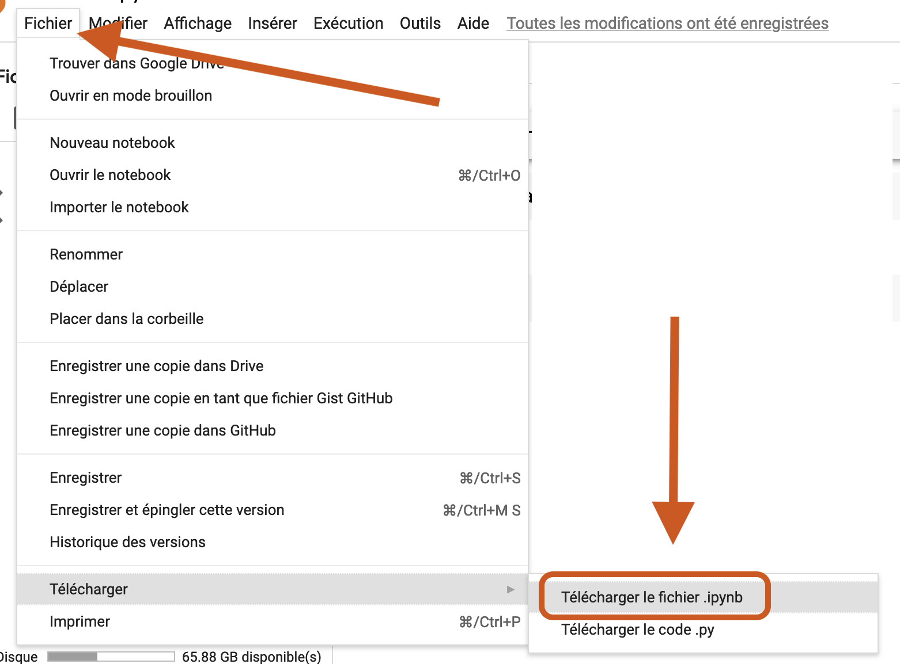

# 🛠 Travaux

Les travaux à remettre ont été mentionnés brièvement dans les pages précédentes. Je vous donne, ci-dessous, un peu plus de détails sur chacun de ces éléments d'évaluation.

### Devoir 1 (10 points) - Amateurs de sport, bonsoir 

Vous travaillez à partir d'une variable appelée `publications`.

C'est une liste qui contient 1436 autres listes. Chacune de ces autres listes contient des données sur les 1436 publications (ou _« posts »_) Facebook publiées en février 2021 par **RDS**, **TVA Sports** et **Radio-Canada Sports**. Chacune contient 13 éléments :

* Nom du média
* Date et heure de la publication
* Type (lien, image, vidéo, etc.)
* URL (vous pouvez tester; chaque URL vous mènera au _« post »_ en question)
* Nombre de « j'aime » suscités par la publication
* Nombre de commentaires
* Nombre de fois que la publication a été partagée
* Nombre de :heart:
* Nombre de :astonished:
* Nombre de :laughing:
* Nombre de :cry:
* Nombre de :rage:
* Nombre de câlinours

La somme des neuf derniers éléments (partages, commentaires et réactions \[« j'aime » et autres émoticônes]) est ce qu'on appelle les **interactions** (_« engagement »_, en anglais).

#### Étape 1

Créez un carnet dans Colab. Appelez-le **devoir1.ipynb**.

#### Étape 2

Utilisez le bouton marqué par la flèche ci-dessous...

... pour y téléverser le fichier **fbSports.py** que vous pouvez trouverez ci-dessous :



#### Étape 3

Entrez la ligne de code suivante dans la première cellule de votre carnet :

<mark style="color:purple;">`from`</mark>` ``fbSports`` `<mark style="color:purple;">`import`</mark>` ``publications`

La variable `publications` est désormais à votre disposition. Si vous cherchez à en voir la taille à l'aide de la fonction `len()`, vous devriez obtenir 1436.

#### Étape 4

Complétez votre carnet avec du code qui vous permettra d'effectuer différentes opérations sur la variable `publications` afin de répondre aux questions suivantes :

* Quel est le média dont les publications ont suscité le plus d'interactions au total en février 2021?
* Les publications de ce média ont suscité combien d'interactions au total?
* Quel est le média dont chacune des publications a, en moyenne, suscité le plus d'interactions en février 2021?
* Chaque publication de ce média a suscité combien d'interactions?

Incluez dans votre carnet des cellules de texte pour expliquer ce que fait votre code et pour répondre aux questions.

#### Étape 5

Téléchargez votre carnet en format .ipynb sur votre ordinateur.

Remettez votre carnet (**devoir1.ipynb**) dans Moodle.

Tombée : 23h59, le lundi 24 janvier 2022.

### Devoir 2 (10 points) - Description à venir 

Vous me remettez votre carnet (**devoir2.ipynb**) par Moodle.

Tombée : 23h59, le lundi 31 janvier 2022.

### Devoir 3 (15 points) - Moissonnage (description à venir) 

Vous me remettez votre carnet (**devoir3.ipynb**) par Moodle.

Tombée : 23h59, le lundi 14 février 2022 :heart\_decoration:.

### Devoir 4 (10 points) - Description à venir 

Vous me remettez votre carnet (**devoir4.ipynb**) par Moodle.

Tombée : 23h59, le lundi 7 mars 2022.

### Devoir 5 (10 points) - Description à venir 

Vous me remettez votre carnet (**devoir5.ipynb**) par Moodle.

Tombée : 23h59, le lundi 28 mars 2022.

### Projet final (25 points)

Pour votre projet final, vous avez deux options. Vous pouvez faire :

* un <mark style="background-color:blue;">**reportage**</mark> ou
* un <mark style="background-color:green;">**outil**</mark>

Si vous choisissez l'**option **<mark style="background-color:blue;">**reportage**</mark>, vous pouvez le faire sur un **sujet** de votre choix (conditionnel à mon approbation). Vous avez aussi le choix de la **forme** de ce reportage : il peut s'agir d'un article, d'un reportage radio, d'un reportage télé ou d'un reportage web.

La production de ce reportage ou de cet outil devra impliquer de la programmation en Python pour moissonner et/ou traiter et/ou visualiser des données.

Votre reportage devra également :

* comprendre **au moins une entrevue** avec un expert, un témoin, ou tout autre intervenant en mesure de valider ou d'incarner ce que racontent les données dans votre reportage.

L'**option **<mark style="background-color:green;">**outil**</mark> peut prendre diverses formes. Il peut s'agir d'un robot sur Twitter, d'un outil qui automatise des tâches fastidieuses dans une salle de presse, etc. Si vous vous êtes déjà dit : « Hé! Ce serait cool si on pouvait faire telle chose! » Eh bien, allez-y! Faites-la! _W kapab_!

### _Making-of_ (10 points)

Quelle que soit la forme que prendra votre travail final, il devra être accompagné d'un texte **(en format PDF)** qui :

* compte entre 3 000 et 5 000 caractères;
* comprend des liens vers **toutes** les sources de documentation qui vous ont aidées en cours de route;
* comprend des hyperliens vers **toutes** les sources de vos données et/ou carnets que vous avez utilisés (s'il y a lieu);
* décrit votre démarche :
  * Pourquoi ce sujet?
  * Quels outils ou quelles technologies avez-vous utilisés?
  * Pourquoi les avoir choisi(e)s?
  * Comment vous ont-ils(elles) servi?
  * Quels problèmes avez-vous éprouvés (s'il y a lieu).

Votre document PDF doit être accompagné, s'il y a lieu, de tous les carnets que vous avez écrits, et/ou de tous les autres fichiers pertinents **(.py, .csv, .ods, .xls, .sql ou autres)** que vous avez récoltés ou dont vous vous êtes servis.

Vous mettez tout cela dans Moudeul avant la fin du dernier cours (12h30, le 21 avril 2022) _por favor_.
